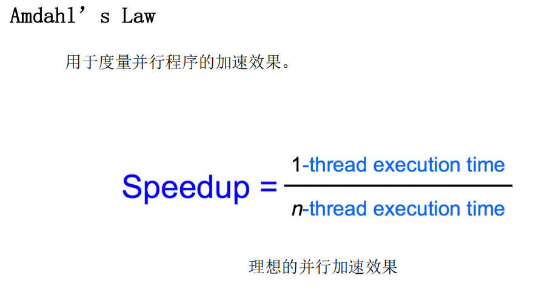
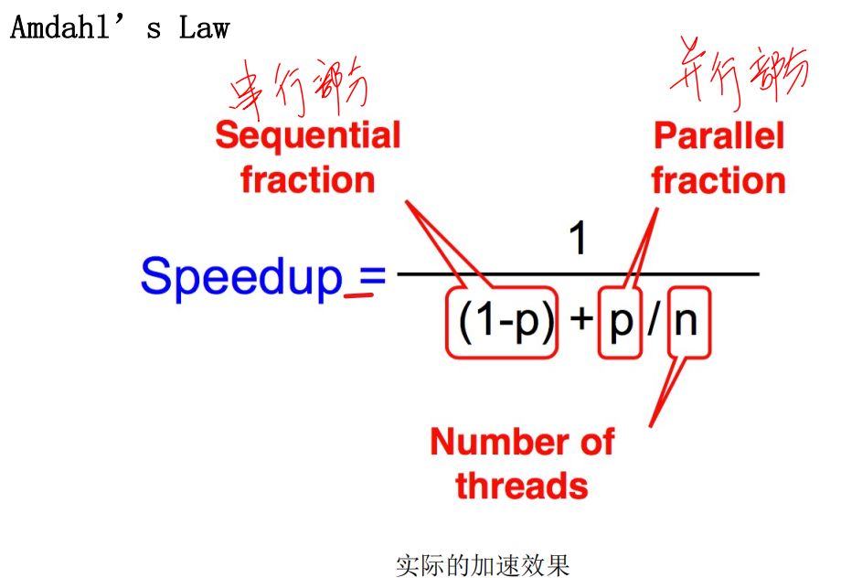
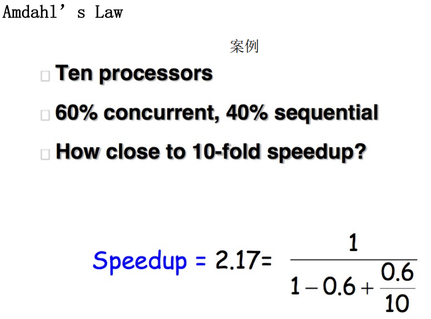
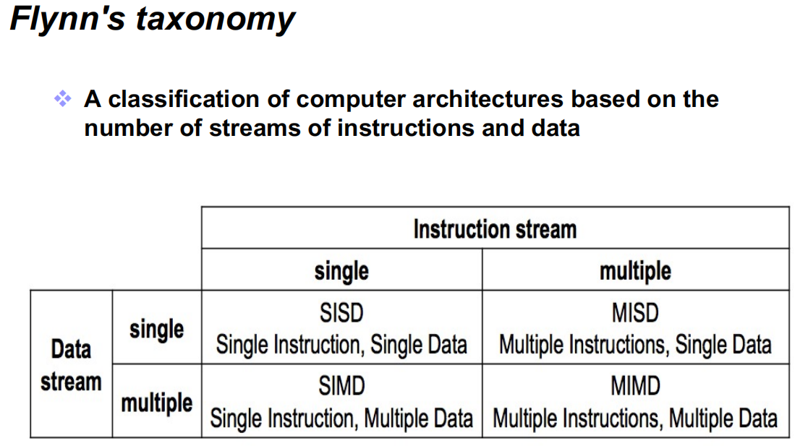

**第一讲：并行计算概览，内容要点：**

1. 什么是并行计算？

   - 程序运行在多个CPU上；
   - 一个问题被分解成离散可并发解决的小部分；
   - 每一小部分被进一步分解成一组指令序列；
   - 每一部分的指令在不同的CPU上同时执行；
   - 需要一个全局的控制和协调机制；

2. 并行计算有哪些优势？

   - 节省时间和花费
   - 解决更大／更复杂问题
   - 实现并发处理
   - 利用非本地资源
   - 更好地发挥底层并行硬件

3. 并行计算的主要用途？

   - 科学和工程计算
   - 工业和商业应用
   - 全球范围的应用

4. 并行计算的主要推动力是什么？

    - 应用发展趋势
    - 构架发展趋势

5. 并行计算的粒度？

    - 函数级并行、线程级并行还是进程级并行

6. 并行计算的难点？

    - 编程代价不同、优势不同；
    - 并行编程需要不同的，不熟悉的算法；
    - 并行编程必须利用不同的问题抽象；
    - 并行程序的行为更复杂；
    - 更难以控制程序不同组件之间的交互；
    - 需要掌握更多编程工具、更多知识等；

7. **Amdahl’s law?**

**第二讲：并行架构，内容要点：**

1. **Flynn’s 并行架构分类？**

    1966年，Flynn将处理器系统结构分成4类

    - SISD：处理器有一次处理一条指令，每条指令处理一份数据 （single instruction single data）

    - SIMD：一次处理一条数据，一条指令可以处理多分数据（数据并行）

    - MISD：一次处理多条指令，每条指令处理一份数据（此设计无用）

    - MIMD：一次处理多条指令，每条指令可以处理多分数据

2. 什么是 pipeline?

    - 流水线，将计算机指令处理过程拆分为多个步骤，并通过多个硬件处理单元并行执行来加快执行速度。

3. 有哪些形式的指令级并行？

4. 什么是 Pthreads？

5. **内存局部性原则有哪些？**
6. 内存分层？
7. **Caches 在内存分层结构中的重要作用**
8. 新型存储系统的构成？
9.  什么是并行架构？
10. **MIMD 的并行架构包括哪些实现类型？**
11. MPP 架构的典型例子及主要构成？

**第三讲： 并行编程模型，内容要点：**

1. 什么是并行编程模型？
2. **并行编程模型的主要包括哪些类型？主要特点是什么？**
3. 并行编程模型主要包括哪几部分？
4. 共享内存模型有哪些实现？
5. 造成并行编程模型不能达到理想加速比的原因？
6. 任务（Task）和线程（Thread）之间的关系？
7. **什么是线程竞争？如何解决？**

**第四讲：并行编程方法论，内容要点：**

1. 什么是增量式并行化？
2. **Culler 并行设计流程？**
3. **Foster 并行设计流程？**
4. 按数据分解和按任务分解的特点？
5. 并行任务分解过程中应该注意的问题有哪些？
6. 整合的意义是什么？
7. Mapping（映射）如何决策？
8. 熟悉一些并行设计的例子。

**第五讲：OpenMP 并行编程模型，内容要点：**

1. 什么是 OpenMP？
2. OpenMP 的主要特定是什么？
3. **熟悉 OpenMP 的关键指令。**
4. **熟悉 OpenMP 关键指令的执行过程。**

**第六讲：OpenMP 中的竞争和同步，内容要点：**

1. OpenMP 中为了保证程序正确性而采用哪些机制？
2. 什么是同步，同步的主要方式有哪些？
3. **OpenMP Barrier 的执行原理。**
4. OpenMP 中竞争的例子。
5. **OpenMP 中避免数据竞争的方式有哪些？**
6. OpenMP Critical 与 Atomic 的主要区别是什么？

**第七讲：OpenMP 性能优化，内容要点：**

1. 什么是计算效率？
2. 调整后的 Amdahl 定律如何理解？
3. **OpenMP 中 Loop 调度的几种方式，执行过程。**
4. **OpenMP 中 Loop 转换的方式包括哪几种？熟练掌握。**

**第八讲：MPI 编程模型，内容要点：**

1. 什么是 MPI 编程模型？
2. 消息传递性并行编程模型的主要原则是什么？**
3. **MPI 中的几种 Send 和 Receive 操作包括原理和应用场景。**
4. **MPI 中的关键编程接口。**
5. 什么是通信子？
6. **MPI 中解决死锁的方式有哪些？**
7. MPI 中的集群通信操作子有哪些？原理是什么？

**第九讲：MPI 与 OpenMP 联合编程，内容要点：**

1. 如何利用 MPI 实现 Matrix-vector 乘积？不同实现的特点是什么？
2. MPI 和 OpenMP 结合的优势是什么？
3. 如何利用 MPI+OpenMP 实现高斯消元？

**第十讲：GPGPU、CUDA 和 OpenCL 编程模型，内容要点：**

1. CUDA 的含义是什么？
2. CUDA 的设计目标是什么？与传统的多线程设计有什么不同？
3. **什么是 CUDA kernel?**
4. **CUDA 的编程样例。**
5. **CUDA 的线程分层结构。**
6. **CUDA 的内存分层结构。**
7. CUDA 中的内存访问冲突。
8. OpenCL 运行时编译过程。

**第十一讲：MapReduce 并行编程模型，内容要点：**

1. **为什么会产生 MapReduce 并行编程模型？**
2. **MapReduce 与其他并行编程模型如 MPI 等的主要区别是什么？**
3. **MapReduce 的主要流程是什么？**
4. MapReduce 的简单实现。如 Hello World 例子。
5. MapReduce 具有哪些容错措施？
6. MapReduce 存在哪些优化点？
7. **MapReduce 可以解决的问题有哪些？**

**第十二讲：基于 Spark 的分布式计算，内容要点：**

1. **Spark 与 Hadoop 的区别和联系。**
2. 传统 MapReduce 的主要缺点是什么？
3. **Spark 中的 RDD 如何理解？**
4. Spark 样例程序。

**第十三讲：离散搜索与负载均衡，内容要点：**

1. **深度优先搜索的主要流程。**
2. **深度优先搜索的复杂度。**
3. 并行深度优先搜索的主要设计思想。
4. **动态负载均衡的三种方式，以及每种方式的额外开销复杂度。**
5. **最优搜索的处理过程。**
6. 并行最优搜索的主要思想和实现方式。
7. 什么是加速比异常？主要分为哪几类？

**第十四讲：并行图算法**

1. 最小生成树的串行和并行算法原理；
2. Prim 并行算法的复杂度；
3. 单源最短路径算法的原理；
4. 单源最短路径算法的并行算法的复杂度；
5. 基于 Dijkstra 的并行 All-pair 最短路径算法的复杂度；
6. Floyd 并行算法的复杂度； 

**第十五讲：性能优化之一（任务分派和调度），内容要点：**

1. 负载均衡主要有哪些方式？分别有什么特点？
2.  静态、动态负载均衡适用的场景是什么？
3.  如何选择任务的粒度？
4.  **Cilk_spawn 的原理是什么？**
5.  **Cilk_sync 的原理是什么？**
6.  Cilk_spawn 的调度方式有哪些？各自有什么特点？
7.  Cilk_spawn 中任务在不同线程之间 steal 的过程。
8.  Cilk_sync 的几种实现方式。

**第十六讲：性能优化之一（局部性、通行和竞争），内容要点：**
1. 吞吐量和延迟的定义；
2. 提高程序吞吐有哪些方法？
3. 通信时间和通信代价的定义；
4. 什么是人为通信？什么是天然通信？结合具体的例子说明
5. 减少通信的方法有哪些？
6. 减少竞争的方法有哪些？