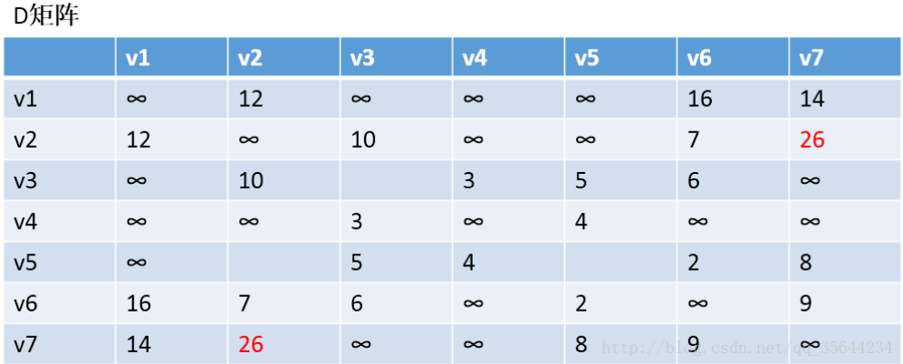
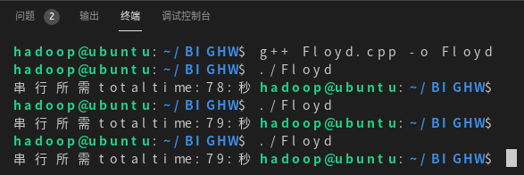

# **并行与分布式计算大作业**

### 姓名：唐晨轩
### 学号：19335182

## **1.实验主题**
    利用串行，MPI，OpenMP实现Floyd算法（弗洛伊德算法）

## **2.Floyd算法简介**
    Floyd 算法是 所有点到所有点的最短路径的算法；
    Floyd 算法基于「贪心」、「动态规划」求一个图中 所有点到所有点最短路径，时间复杂度 O(n^3)。

    - 算法的特点：
    弗洛伊德算法是解决任意两点间的最短路径的一种算法，可以正确处理有向图或有向图或负权(但不可存在负权回路)的最短路径问题，同时也被用于计算有向图的传递闭包。

    - 算法的思路：
    通过Floyd计算图G=(V,E)中各个顶点的最短路径时，需要引入两个矩阵，矩阵D中的元素D[i][j]表示顶点i(第i个顶点)到顶点j(第j个顶点)的距离。矩阵P中的元素P[i][j]，表示顶点i到顶点j经过了P[i][j]记录的值所表示的顶点。
    假设图G中顶点个数为N，则需要对矩阵D和矩阵P进行N次更新。初始时，矩阵D中顶点D[i][j]的距离为顶点i到顶点j的权值；如果i和j不相邻，则D[i][j]=∞，矩阵P的值为顶点P[i][j]的j的值。 接下来开始，对矩阵D进行N次更新。
    第1次更新时，如果”D[i][j]的距离” > “D[i][0]+D[0][j]”(D[i][0]+D[0][j]表示”i与j之间经过第1个顶点的距离”)，则更新D[i][j]为”D[i][0]+D[0][j]”,更新P[i][j]=P[i][0]。
    同理，第k次更新时，如果”D[i][j]的距离” > “D[i][k-1]+D[k-1][j]”，则更新D[i][j]为”D[i][k-1]+D[k-1][j]”,P[i][j]=P[i][k-1]。更新N次之后，操作完成！

## **3.Floyd算法图示介绍**

以下图为例子：

我们求每个点对之间的最短路径；


第一步，我们先初始化DP两个矩阵，得到下图两个矩阵；


第二步，以v1为中介，更新两个矩阵：
发现，D[1][0]+D[0][6] < D[1][6]和D[6][0]+D[0][1] < D[6][1]，所以我们需要更新矩阵D和矩阵P，结果如下：




通过矩阵P，我们发现v2-v7的最短路径是v2-v1-v7

第三步：以v2为中介，来更新两个矩阵，原理一致；


到这里就明白Floyd算法是如何运行的了，它每次都会选择一个中介点，然后，遍历整个矩阵，查找需要更新的值，下面还剩下五步，就不继续演示下去了，理解了方法，我们就可以写代码了。

## **4.Floyd算法的代码实现**

串行,MPI,OpenMP实现的代码均在压缩包中，这里就不全部呈现出来了。只看看核心部分即可。

串行实现：
```c++
//这里是弗洛伊德算法的核心部分 
//k为中间点 
for(k = 0; k < G.vexnum; k++){
    //v为起点 
    for(v = 0 ; v < G.vexnum; v++){
        //w为终点 
        for(w =0; w < G.vexnum; w++){
            if(D[v][w] > (D[v][k] + D[k][w])){
                D[v][w] = D[v][k] + D[k][w];//更新最小路径 
                P[v][w] = P[v][k];//更新最小路径中间顶点 
            }
        }
    }
}
```

MPI实现：
```c++
    int n=3000;               //图的顶点数
	double start1,end1;
	int i,p,my_rank;
	int* local_mat=NULL;  //为了更好的分配邻接矩阵，这里采用的是一维数组
	int **juzhen;         //定义二维数组
	MPI_Comm comm;         
	//为二维数组juzhen分配动态内存空间
	juzhen=(int **)malloc(n*sizeof(int *));
	for (i=0;i<n;i++)
	{
		juzhen[i]=(int *)malloc(n*sizeof(int));
	}
	local_mat = (int *)malloc(n*n*sizeof(int));   //为local_mat分配动态内存空间
	MPI_Init(&argc, &argv);  //初始化并行环境
	comm = MPI_COMM_WORLD;  
	MPI_Comm_size(comm, &p); //获取MPI的线程数量
	MPI_Comm_rank(comm, &my_rank);    //获取进程ID
	start1=MPI_Wtime();      //MPI开始起点计时
	MPI_Bcast(&n, 1, MPI_INT, 0, comm);  //将顶点数量广播给所有进程
	local_mat = (int *)malloc(n*n/p*sizeof(int));  
	Read_matrix(local_mat, n, my_rank, p, comm);       //0号进程读入邻接矩阵，然后分给所有进程
	Floyd(local_mat, n, my_rank, p, comm);
	free(juzhen);            //释放矩阵juzhen的内存空间
	free(local_mat);        //释放矩阵local_mat的内存空间
	end1=MPI_Wtime();       //MPI结束终点计时
	if (my_rank==0)
		printf("当线程数量为%d,MPI编程toltaltime=%f",p,end1-start1);
	MPI_Finalize();        //退出MPI程序
```

OpenMP实现：

```c++
//在共享内存编程中初始化二维矩阵P,D
#pragma omp parallel for num_threads(thread_count)default(none) shared(array1,P,D,max) private(v,k,w)
	
	for(v = 0; v < max; v++){
		for(w = 0; w < max; w++){
			D[v][w] = array1[v][w];
			P[v][w] = w;
		}
	}

//在共享内存中进行Floyd算法
#pragma omp parallel for num_threads(thread_count)default(none) shared(array1,P,D,max) private(v,k,w)
	for(k = 0; k < max; k++){
		//v为起点 
		for(v = 0 ; v < max; v++){
			//w为终点 
			for(w =0; w < max; w++){
				if(D[v][w] > (D[v][k] + D[k][w])){
					D[v][w] = D[v][k] + D[k][w];//更新最小路径 
					P[v][w] = P[v][k];//更新最小路径中间顶点 
				}
			}
		}
	}
```

## **5.实验结果**

实验使用的顶点个数为3000个，邻接矩阵大小为3000*3000；

首先是我的虚拟机配置：(处理器数量为2，所以线程/进程数为2时会达到最优)


最终得到的大致运行时间如下图所示：

**串行：**



**MPI：**


**OpenMP：**


**总结：**

输出结果与预期一致。

可以看到，在如此巨大的输入的情况下，由于Floyd算法的时间复杂度是O(n^3)，所以串行实现很明显比两种并行实现要慢了很多，由此可以肯定并行化Floyd算法取得了成功。

## **6.实验感想**

通过这次实验，我切实的体会到了并行化处理对于这种大量数据的计算的优势。也通过改变线程/进程的数量，感受到了合理的线程/进程数量对性能的影响有多么关键(尤其是对于MPI)。选择这个主题的灵感来源于教学PPT的第14讲---并行图算法，其中的Dijkstra算法和Prim算法都是耳熟能详的算法了，也在其他课程上实现过串行实现，所以这次就选择实现这个PPT中介绍的第三个算法Floyd算法的串行与并行实现。

总的来说本次实验顺利完成了，收获颇丰。